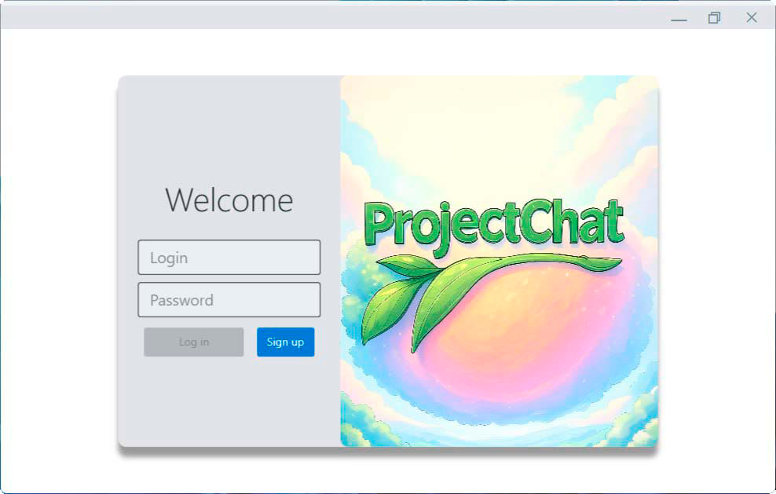
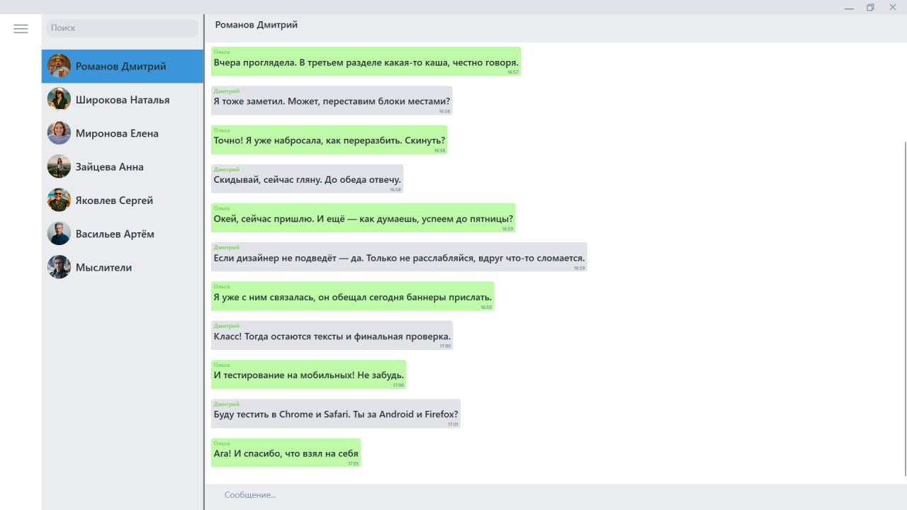
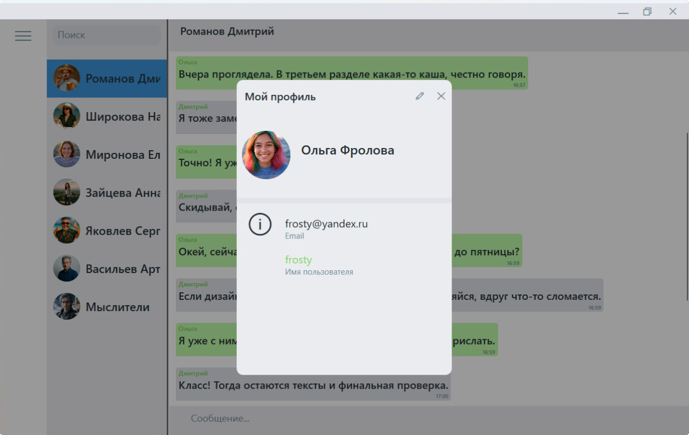
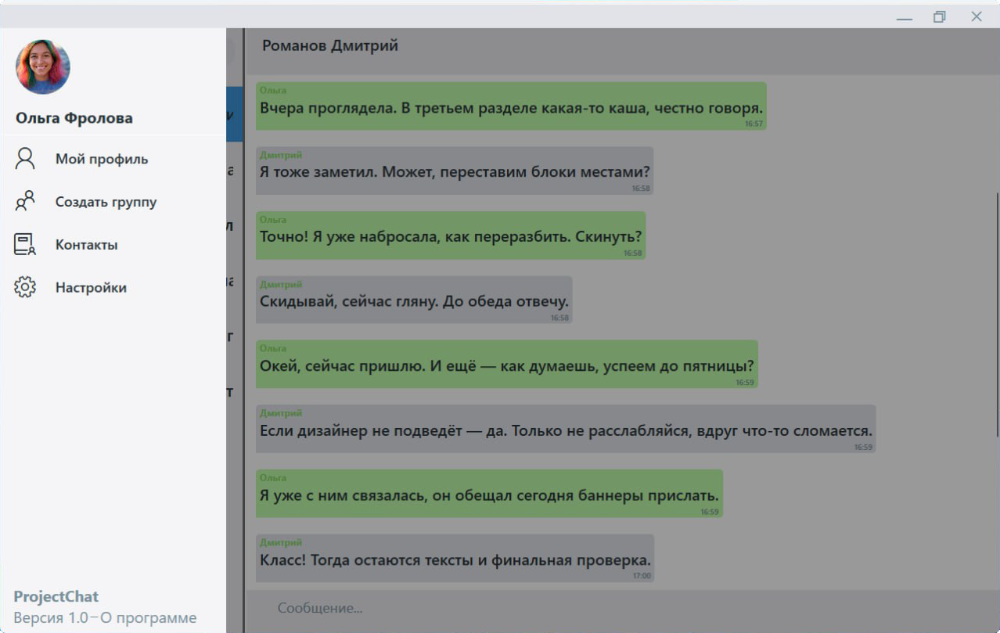
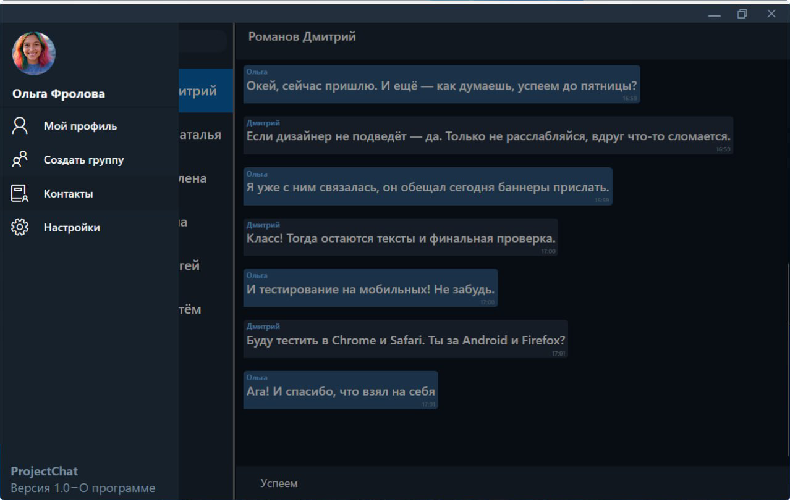

[](https://dotnet.microsoft.com/en-us/download/dotnet/8.0)
[](https://learn.microsoft.com/ru-ru/ef/core/get-started/overview/install)
[](https://www.microsoft.com/en-us/sql-server/sql-server-downloads)


 

# О проекте
**ProjectChat** — это ```клиент-серверное``` приложение, разработанное с целью углубления знаний в сетевом программировании и архитектурных паттернах. Начавшись как простой чат, проект превратился в полноценный мессенджер. Сейчас он завершен, так как основные цели достигнуты. Однако его совершенствование может продолжаться бесконечно. ✨

# 🌟 Ключевые моменты
- 🖥️ **Архитектура**: Клиент-серверная модель
- 👥 **Функционал**:
  - Авторизация пользователей
  - Личные и групповые чаты
  - Пользовательские аватарки
  - Настройки профиля
- 🔐 **Безопасность**: 
  - Шифрование паролей через BCrypt
  - Токен-аутентификация
- 🎨 **Кастомизация**:
  - Светлая/тёмная темы
  - Настройка размера шрифта сообщений


  ## 🛠️ Технологический стек
  | Компонент       | Технологии                     |
  |-----------------|--------------------------------|
  | **Клиент**      | WPF, MVVM, EventAggregator     |
  | **Сервер**      | TCP-сокеты, MS SQL Server, EF Core |
  | **Общие**       | .NET 8, JSON          |
  | **Безопасность**| BCrypt, токен-аутентификация   |

## 🗃️ Структура проекта
```
📦 ProjectChat
├── 📂ChatClient                # Клиентское приложение
│ ├── 📂Converters              # Конвертеры для WPF
│ ├── 📂CustomControls          # Кастомные элементы UI
│ ├── 📂Images                  # Ресурсы изображений
│ ├── 📂Services                # Сервисы (сеть, EventAggregator)
│ ├── 📂Styles                  # Стили и темы
│ ├── 📂View                    # Представления
│ └── 📂ViewModels              # ViewModels (MVVM)
│
├── 📂ChatShared                # Общая библиотека
│ ├── 📂DTO                     # Data Transfer Objects
│ └── 📂Events                  # Системные события
│
└── 📂ChatServer                # Серверная часть
├── 📂Data                      # Доступ к данным
├── 📂Handler                   # Обработчики запросов
├── 📂Migrations                # Миграции БД
├── 📂Models                    # Модели данных
├── 📂Services                  # Бизнес-логика
└── 📂Session                   # Управление сессиями
```
## 🖼️ Скриншоты
<p align="center">
    
    
    
    
    
</p>

## 💡 Особенности реализации
1. **Сетевое взаимодействие**:
   - Обмен DTO через TCP в JSON-формате
   - EventAggregator для обработки событий
   - Асинхронные операции сокетов
   - Токен-аутентификация

2. **Клиент**:
   - MVVM с разделением View/ViewModel
   - Локальное хранение настроек в JSON
   - Кастомизация UI (темы, шрифты)
   - [ModernWpf](https://github.com/Kinnara/ModernWpf) для быстрых UI-набросков

3. **Сервер**:
   - EF Core для работы с SQL Server
   - BCrypt для шифрования паролей
   - Хранение аватаров в файловой системе
   - Управление сессиями пользователей

## 🚀 **Возможные улучшения**
  - Переход с Base64 на URL-формат
  - Добавить верификацию email через отправку кода
  - Возможность прикреплять документы (Файлообменник) 
  - Изменение/удаление сообщений
  - Desktop-оповещения о новых сообщениях
  - Индикация активности пользователей

## 📬 Контакты
✉️ **Email**: [diz.shulinus@yandex.ru](mailto:diz.shulinus@yandex.ru)  
📱 **Telegram**: [@mysarias](https://t.me/mysarias)

